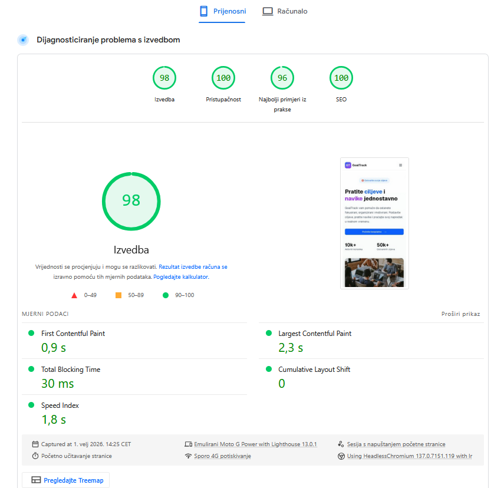
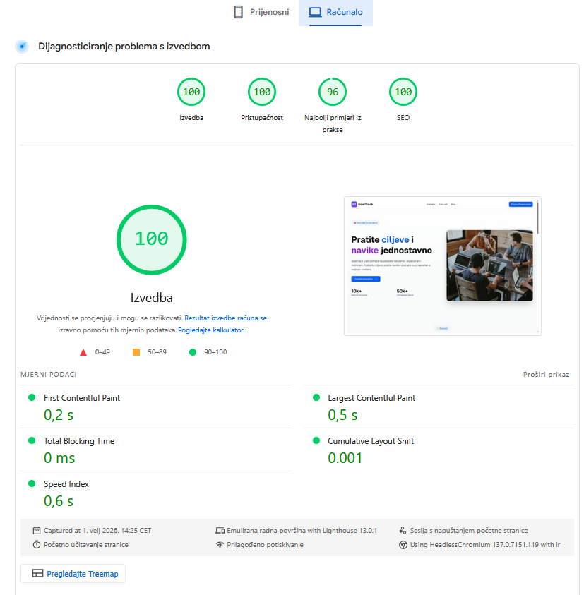

# Final Report
## GoalTrack

**Students:** Ante Goreta & Zvonimir Damjanović  
**Course:** Human–Computer Interaction  
**Date:** 1.2.2026  
**Live App:** https://hci-2025-26-project.vercel.app/  
**GitHub Repository:** https://github.com/goretante/HCI-2025-26-project  

---

## 1. Project Idea

The main idea behind **GoalTrack** is to create a web application that helps individuals organize, track, and achieve their personal goals and daily habits in a simple and motivating way.

Many people struggle with maintaining consistency in their personal development journey. They set ambitious goals—whether related to fitness, learning, productivity, or health—but lack a structured system to track progress and stay motivated. GoalTrack aims to solve this problem by providing a centralized platform where users can define goals, build healthy habits, visualize their progress, and receive motivational insights through a blog.

The goal of the application is to empower users to transform their aspirations into concrete achievements through better planning, tracking, and self-discipline.

## 2. The Problem

Currently, people use scattered methods to track their goals and habits:

- Physical notebooks and planners
- Generic to-do list apps
- Spreadsheets
- Calendar reminders
- Multiple disconnected apps

This creates several major issues:

- **Lack of centralization** – Information is spread across different tools
- **No progress visualization** – Hard to see long-term improvements
- **Low motivation** – No reinforcement or encouragement system
- **Forgotten goals** – No regular reminders or tracking mechanisms
- **Complexity** – Existing solutions are often overcomplicated

As a result, users lose motivation, forget their goals, and struggle to maintain consistent habits that lead to personal growth.

## 3. Target Users

### Primary Users
- **Students** – managing academic goals and study habits
- **Working professionals** – balancing career objectives and personal development
- **Fitness enthusiasts** – tracking workout routines and health goals
- **Self-improvement seekers** – individuals focused on personal growth

### Secondary Users
- **People with ADHD or executive function challenges** – needing structured organization
- **Career changers** – tracking skill development and learning goals
- **Parents** – managing family and personal responsibilities

### Age Range
- Primarily individuals aged 18-45 who are tech-savvy and motivated to improve their lives through structured goal-setting and habit-building.

---

## 4. Proposed Solution

**GoalTrack** is a user-friendly web application that allows:

- Defining and organizing personal goals
- Tracking daily habits with progress indicators
- Visualizing achievements through a dashboard
- Reading motivational blog content
- Managing goals by categories and priorities
- Receiving progress insights and statistics

### Key Features

- **Goal Management** – Create, edit, delete, and organize goals  
- **Habit Tracking** – Daily habit completion with streaks and statistics  
- **Progress Dashboard** – Visual representation of achievements  
- **Motivational Blog** – Curated content for inspiration and guidance  
- **User Authentication** – Secure login and personal data management  
- **Responsive Design** – Seamless experience on desktop, tablet, and mobile  

## 5. User Personas

### Ema Novak – Marketing Specialist

- **Age:** 29  
- **Occupation:** Marketing Specialist  
- **Location:** Zagreb  
- **Goals:** Balance work projects, fitness goals, and personal reading habits  
- **Motivation:** Organized and ambitious, wants a simple tool to track everything in one place  
- **Frustration:** Juggling multiple apps for different goals  
- **Quote:** *"I need one app where I can see all my progress at a glance."*

### Luka Horvat – University Student

- **Age:** 22  
- **Occupation:** University Student  
- **Location:** Split  
- **Goals:** Improve study habits, track exam preparation, develop new skills  
- **Motivation:** Goal-oriented, likes gamification and visual progress indicators  
- **Frustration:** Forgetting daily tasks and losing motivation  
- **Quote:** *"I want to see my progress grow—it keeps me motivated."*

### Mira Kovač – Freelance Graphic Designer and Mother

- **Age:** 45  
- **Occupation:** Freelance Graphic Designer and Mother  
- **Location:** Rijeka  
- **Goals:** Manage work deadlines, personal health, and family responsibilities  
- **Motivation:** Multitasker who values practical and easy-to-use tools  
- **Frustration:** Complicated apps with too many features  
- **Quote:** *"I need something simple that just works—no learning curve."*

## 6. Information Architecture

### App Entry
- **Home page** – Serves as the application entry point with hero section, features, how it works, and call-to-action.
- From Home, users can choose to **Login** or **Register**.

### USER FLOW

#### Home
- Introduction to GoalTrack
- Key features overview
- How it works (4-step process)
- Statistics section
- Call-to-action for registration

#### Dashboard
- Overview of all goals and habits
- Progress visualization
- Quick actions for adding goals/habits

#### Goals
- List of all user goals
- Filter by category
- Create, edit, delete goals
- View individual goal details with progress

#### Habits
- Daily habit tracker
- Streak counters
- Completion statistics
- Add, edit, remove habits

#### Progress
- Visual charts and statistics
- Achievement overview
- Motivation insights

#### Blog
- Curated articles on productivity, goal-setting, and self-improvement
- Individual blog post pages
- Pagination for easy navigation

---

## 7. Sitemap

The sitemap defines hierarchical navigation between:

- **Public Pages:**
  - Home
  - Blog
  - Blog Post Details
  - Login
  - Register
  - Forgot Password
  - Reset Password

- **Protected Pages (requires authentication):**
  - Dashboard
  - Goals
  - Goal Details
  - Habits
  - Progress

The structure ensures clarity, intuitive navigation, and fast access to core features.

## 8. Design and User Interface

The interface follows **minimalistic and modern design principles**, focusing on clarity, simplicity, and motivational aesthetics. The design uses gradients, smooth animations, and intuitive layouts to create an engaging user experience.

### Home Page
The Home Page introduces the application with a compelling hero section, showcases key features, explains the 4-step process, displays user statistics, and ends with a strong call-to-action.

### Dashboard
The Dashboard provides a comprehensive overview of all goals and habits, with progress indicators and quick access to main features.

### Goals Page
Lists all user goals with filtering options by category. Users can create new goals, edit existing ones, and view detailed progress for each goal.

### Habits Page
Daily habit tracker with completion checkboxes, streak counters, and visual progress indicators to motivate consistent behavior.

### Progress Page
Visual representation of achievements through charts and statistics, showing how goals and habits contribute to overall growth.

### Blog
Curated motivational content with a clean, readable layout. Smart pagination ensures smooth navigation through multiple articles.

### Login / Registration
Simple and clear authentication forms with password reset functionality, ensuring easy onboarding for users of all technical levels.

---

## 9. HCI Principles Applied

### Usability
- Simple, intuitive flows for creating and tracking goals
- One-click habit completion
- Clear navigation with minimal clicks to any feature

### Consistency
- Unified color scheme and typography across all pages
- Consistent button styles and form layouts
- Predictable navigation patterns

### Learnability
- New users can immediately understand how to create goals and track habits
- Clear visual hierarchy guides user attention
- Tooltips and helpful labels where needed

### Feedback
- Instant visual confirmation when completing habits
- Progress indicators show achievement levels
- Success/error messages for all user actions

### Error Prevention
- Form validation prevents invalid data entry
- Confirmation dialogs for destructive actions (e.g., deleting goals)
- Clear labels and placeholders guide correct input

### Motivation
- Visual progress indicators encourage continued use
- Streak counters gamify habit completion
- Statistics section celebrates achievements
- Motivational blog content provides ongoing inspiration

## 10. Evaluation and Improvements

### Current Strengths
- Clean, intuitive interface
- Comprehensive goal and habit tracking
- Responsive design works seamlessly across devices
- Fast performance and smooth animations
- Secure authentication system

### Potential Future Improvements

- **Gamification Features**
  - Achievement badges for milestones
  - Point system for completed habits
  - Leaderboards (optional, for competitive users)

- **Social Features**
  - Share goals with friends for accountability
  - Goal templates shared by community
  - Encouragement and support groups

- **Advanced Analytics**
  - Detailed trend analysis over time
  - Predictions based on habit patterns
  - Exportable reports

- **Smart Reminders**
  - Push notifications for habit reminders
  - Email summaries of weekly progress
  - Customizable notification times

- **Integration**
  - Calendar integration (Google Calendar, Outlook)
  - Fitness app connections (Strava, Apple Health)
  - Note-taking apps (Notion, Evernote)

- **Offline Mode**
  - Progressive Web App (PWA) capabilities
  - Offline data entry with sync when online

---

## 11. Technologies Used

### Frontend
- **Next.js 16** – React framework with App Router for server-side rendering
- **TypeScript** – Type-safe development
- **Tailwind CSS v4** – Utility-first CSS framework
- **shadcn/ui** – Accessible UI component library
- **Lucide React** – Icon library

### Backend & Database
- **Supabase** – PostgreSQL database, authentication, and real-time features
- **Drizzle ORM** – Type-safe database queries

### Content Management
- **Contentful CMS** – Headless CMS for blog content

### Deployment & Hosting
- **Vercel** – Production hosting with automatic deployments
- **Vercel Analytics** – Performance and user behavior tracking

---

## 12. Performance Testing

Performance testing was conducted using **Google PageSpeed Insights** to ensure optimal user experience.

### Mobile Result
- **Performance Score:** 98
- Optimized images and lazy loading
- Efficient CSS and JavaScript
- Fast Time to Interactive (TTI)

### Desktop Result
- **Performance Score:** 100
- Server-side rendering for faster initial load
- Optimized fonts and assets
- Minimal layout shifts

## 13. Conclusion

**GoalTrack** successfully demonstrates how HCI principles can be applied to create a meaningful and empowering digital product.

The application addresses a real problem that many people face: the challenge of staying organized, motivated, and consistent in pursuing personal goals and building healthy habits. By providing a centralized, intuitive, and visually appealing platform, GoalTrack transforms the often-overwhelming task of self-improvement into an engaging and achievable journey.

Through careful consideration of usability, accessibility, and user motivation, GoalTrack offers a solution that is:

- **Simple** – Easy to learn and use for all age groups
- **Effective** – Provides tangible tools for goal achievement
- **Motivating** – Encourages continued engagement through visual progress
- **Accessible** – Works seamlessly across devices and user abilities
